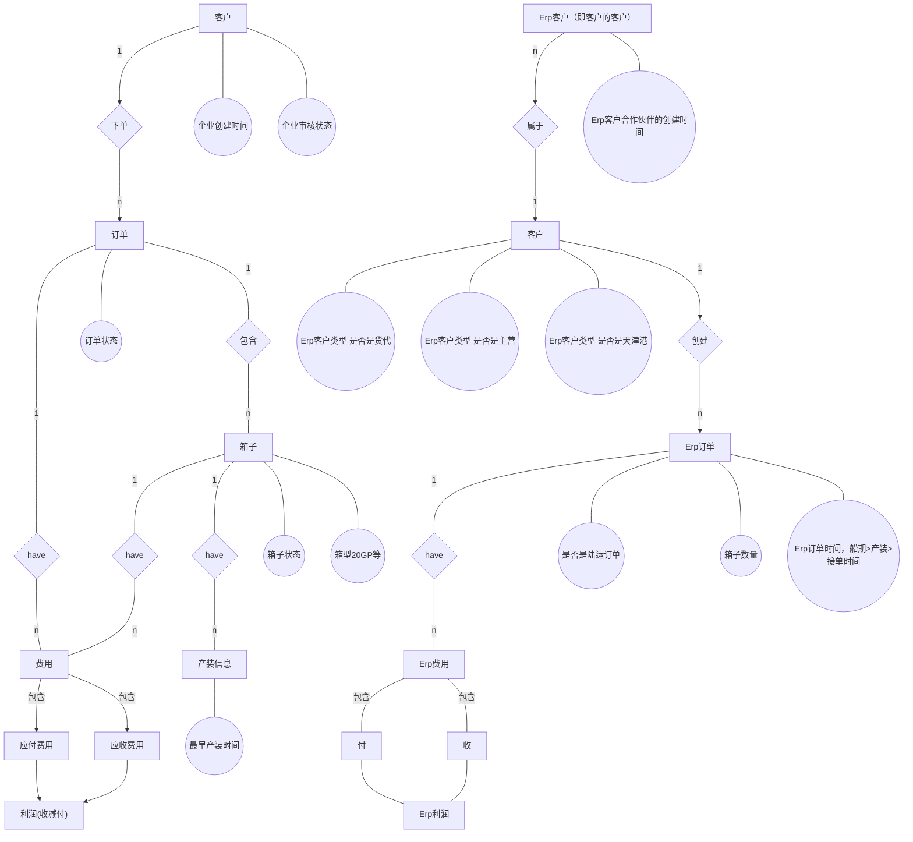

## 箱信数据统计

箱信数据包括两部分

* 中台系统
* erp系统

```mermaid
graph TD

Enter["客户"] -->|"1"| CreateOrder{"下单"}
CreateOrder -->|"n"| Order["订单"]
Order ---|"1"| 包含1{"包含"} ---|"n"| Box["箱子"]
Box ---|"1"| 拥有1{"have"} ---|"n"| Financial["费用"]
Order ---|"1"| 拥有2{"have"} ---|"n"| Financial
Box ---|"1"| 拥有3{"have"} ---|"n"| Product["产装信息"]
Financial -->|"包含"| inF["应收费用"]
Financial -->|"包含"| outF["应付费用"]
inF --> Profit["利润(收减付)"]
outF --> Profit

Enter --- EnterCreateTime(("企业创建时间"))
Enter --- EnterStatus(("企业审核状态"))
Order --- OrderStatus(("订单状态"))
Box --- BoxStatus(("箱子状态"))
Box --- BoxSizeType(("箱型20GP等"))
Product --- MinProductTime(("最早产装时间"))

ErpParnter["Erp客户（即客户的客户）"] -->|"n"| Shuyu{"属于"} -->|"1"| ErpEnter["客户"]
ErpEnter -->|"1"| CreateErpOrder{"创建"} -->|"n"| ErpOrder["Erp订单"]
ErpOrder ---|"1"| 拥有4{"have"} ---|"n"| ErpFinancial["Erp费用"]
ErpFinancial ---|"包含"| inErpF["收"]
ErpFinancial ---|"包含"| outErpF["付"]
inErpF --- ErpProfit["Erp利润"]
outErpF --- ErpProfit

ErpParnter --- ParnterCreateTime(("Erp客户合作伙伴的创建时间"))
ErpEnter --- isHuodai(("Erp客户类型 是否是货代"))
ErpEnter --- isZhuying(("Erp客户类型 是否是主营"))
ErpEnter --- isTianjin(("Erp客户类型 是否是天津港"))
ErpOrder --- isLuyun(("是否是陆运订单"))
ErpOrder --- BoxInfo(("箱子数量"))
ErpOrder --- ErpTime(("Erp订单时间，船期>产装>接单时间"))
```

