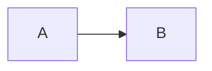

# TITLE1

## TITLE2

### TITLE3

#### TITLE4

##### TITLE5

###### TITLE6

####### TITLE7


# TITLE11


## Er图



## 流程图

### 纵向

```flow
st=>start: 开始框
op=>operation: 处理框
cond=>condition: 判断框(是或否?)
sub1=>subroutine: 子流程
sub2=>subroutine: 子流程2
io=>inputoutput: 输入输出框
e=>end: 结束框

st->op->cond
cond(yes)->io->e
cond(no)->sub1(right)->sub2(right)->op
```

### 横向

```flow
st=>start: 开始框
op=>operation: 处理框
cond=>condition: 判断框(是或否?)
sub1=>subroutine: 子流程
io=>inputoutput: 输入输出框
e=>end: 结束框

st(right)->op(right)->cond
cond(yes)->io->e
cond(no)->sub1(right)->op
```

## UML时序图

### 时序图

```sequence
TITLE: UML时序图
对象A -> 对象B : 对象b你好吗（请求？）
Note right of 对象B: 对象B的描述
Note left of 对象A: 对象A的描述(提示)
对象B --> 对象A : 我很好（响应）
对象A -> 对象B : 你真的好吗？

对象B -> 对象C : 你谁呀？
对象C -->> 对象A : B找我了
Note over 对象C,对象B: 覆盖的描述
participant D
Note right of D : 没人陪我
```

### 标准时序图

```mermaid
sequenceDiagram

TITLE:标准时序图
%% -> 直线，--> 虚线，->> 箭头
participant 张三
participant 李四
张三 ->> 王五: 王五你好吗？
loop 健康检查
	王五 -> 王五: 与疾病战斗
end
Note right of 王五: 合理食物、锻炼<br/>看医生
李四 -->> 张三: 很好！
王五 ->> 李四: 你怎么样？
李四 -->> 王五: 很好
```

